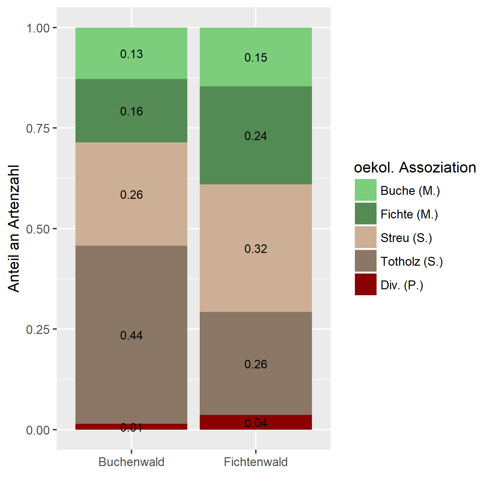

# R analysis of fungal distribution

## Summary
A basic analysis of observation data of forest fungi using R. The aim was to gain some insights into ecological and taxonomical distributions of fungi by comparing empirical data with known species attributes.\
The data were collected and analysed for a practical course at ETH (Ökologie der Pilze im Wald). \
\
Main result: ecological function distribution across two collection sites:

## Methods
See annotations in R script.

## Credit
Data collection was perfomed by multiple course participants and lecturers, the analysis is my own.
